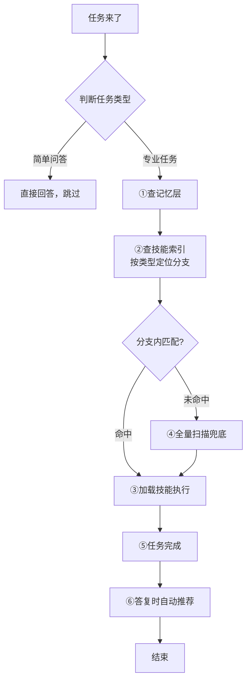

# Skills 宪法（Skills Constitution）

> **一句话定位**：这是凌驾于全部技能/工具/插件之上的**元规则**。无论用什么 Agent 框架，所有能力调用都必须先过这一关。
>
> **v2.15.0** — 推荐排除已装：第五条补"推荐候选必须排除本地已装技能"（推荐前核对本地已装清单）；step5-check.py 新增 Layer E 本地已装排除校验（仓库名与本地技能目录同名 / 与 `_<name>-references` 已装框架标记匹配 → FAIL），杜绝"搜索结果恰好命中已装仓库仍被推荐"
>
> **v2.14.0** — 假查漏洞修复：constitution-gate.py 回归（WorkBuddy 钩子实现），PreToolUse 新鲜度校验（防旧 PASS 永久放行）+ Stop 违规硬记录 + UserPromptSubmit 违规警告注入；hooks 脚本与 frontmatter 去掉 HUAWEI 硬编码（跨机器可用）；安装章节补 WorkBuddy settings.json 三步注册
>
> **v2.13.3** — 失败可定位 + 兜底文案动态化：python 分支 stderr 捕获进 debug.pre_hook_stderr（不再被 2>/dev/null 吞掉）；injected-context.json 新增 python_branch_ok / fallback_reason；bash 兜底文案按真实原因区分「无 python」与「python 分支失败」
>
> **v2.13.0** — 强制拦截上线：hooks.json 注册 SessionStart/UserPromptSubmit 钩子 + ruler apply 一键分发到 10 个平台 + pre-hook --task 参数修复 + Windows 路径转换
>
> **v2.12.0** — SkillWeaver 启发改版：任务同义词扩展（口语任务不再漏判）+ SAD 宽松语义检索注入 + Layer D 语义相关性校验 + 多技能编排兼容性检查 + 可选语义向量索引；修复分类子串误杀（code≠encode）

---

## ⚠️ 前置过滤：任务类型判断（零号条款）

**本宪法仅适用于"专业任务"**，不适用于简单问答。执行前先判断：

| 任务类型 | 特征 | 是否查技能 |
|---------|------|-----------|
| **简单问答** | 翻译、润色、解释概念、一般知识问答 | ❌ 跳过 |
| **专业任务** | 编码、数据抓取、文件操作、API 调用、复杂分析 | ✅ 必须查 |
| **模糊任务** | 不确定是否需要专业工具 | ✅ 查一下（宁可不放过） |

**判断标准**：
- 任务涉及**文件系统、网络请求、代码执行、专业工具** → 专业任务
- 任务只是**文字处理、知识问答、简单解释** → 简单任务

**自我豁免**：本宪法本身是元规则，执行宪法条款时**不需要再次查技能**（防止死循环）。

**误判回退（零号条款-C）**：若 Agent 误判任务类型（如把专业任务当作简单问答跳过），用户有权指出（"这是专业任务，你应该查技能"）。此时 Agent 必须：
1. 道歉并承认误判
2. 立即回退到完整宪法流程（从查记忆开始）
3. 将此次误判记录到记忆层（`MISJUDGMENTS`），避免重复犯错

---

## 痛点

当前 Agent 生态最大的浪费：**装了一堆无敌的 Skill/工具/插件，但 Agent 傻傻的硬扛任务**——明明有更专业的能力可用，却靠通用能力瞎猜，导致：

| 痛点 | 表现 | 后果 |
|------|------|------|
| **不调用** | 任务来了直接干，不扫能力清单 | 装了 100 个技能只用了 3 个 |
| **调用幻觉** | 凭印象选技能，不看描述是否匹配 | 用错技能、答非所问 |
| **调用混乱** | 多个技能都能做，随机挑一个 | 结果不稳定、质量不可控 |
| **能力误判** | 感觉"做不到"就直接拒绝 | 从不检查有没有技能能做 |
| **无复盘** | 做完就走，不看有没有更好技能 | 技能库长期闲置、越装越乱 |
| **扫描全量** | 每次任务扫描全部技能 | 响应慢、消耗高 |

---

## 核心概念（平台无关）

本宪法使用以下**通用术语**，各平台的具体对应物见【平台映射表】：

| 通用术语 | 含义 | 各平台叫法举例 |
|----------|------|----------------|
| **能力注册表** | Agent 当前可用的全部技能/工具/插件清单 | available_skills / tools / plugins / extensions / Gems / MCP servers |
| **技能描述** | 每个能力的触发条件说明 | description / trigger / when_to_use / system prompt |
| **技能索引** | 按功能分类的技能树（预生成，加速匹配）。⚠️ 仓库内 `skill_tree.json` 为**作者快照/示例**，使用者应运行 `scripts/build_skill_tree.py` 生成**自己的**索引 | skill_tree.json（作者快照）/ 你生成的技能树 |
| **技能发现** | 搜索可安装的新能力 | find-skills / GPT Store / SkillHub / MCP Registry / Extensions |
| **记忆层** | 跨会话持久化的规则存储 | MEMORY.md / CLAUDE.md / AGENTS.md / Custom Instructions / .cursorrules |
| **技能文件** | 定义能力的结构化文档 | SKILL.md / GPT Actions / MCP Config / Gem Instructions |

---

## 宪法条款

### 第零条：查记忆（Pre-Check Memory）

**在执行任何任务前，必须先查阅该平台的记忆/规则层**，确认有无相关约定、历史上下文或待办事项。

**各平台记忆层路径**：

| 平台 | 记忆层路径 |
|------|-----------|
| WorkBuddy | `~/.workbuddy/MEMORY.md` + 项目 `.workbuddy/memory/` |
| Claude Code | `CLAUDE.md` 或 `.claude/CLAUDE.md` |
| Cursor | `.cursorrules` + `.cursor/rules/` |
| Windsurf | `.windsurfrules` |
| Cline | `.clinerules` |
| ChatGPT | Custom Instructions |
| Gemini | Gem Instructions |
| Codex | AGENTS.md |
| 通用规则 | 项目根目录 `RULES.md` 或 `.agent/rules.md` |

**查记忆顺序**：
1. 用户级记忆（长期偏好、硬规则）
2. 项目记忆（当前项目约定、历史决策）
3. 今日流水（当天工作记录，避免重复）

**记忆层必备内容**（自举前提：让"查记忆"真正发现技能，v2.3.0 新增）：

为了让宪法自举执行，记忆层中应维护以下两类条目：

| 条目 | 内容 | 示例 |
|------|------|------|
| `INSTALLED_SKILLS` | 已安装技能清单（名称 + 一句话描述） | `file-ops：文件读取/写入工具，用于读取技能索引` |
| `SKILL_INDEX_PATH` | 技能索引文件路径（**你**的技能树，非作者快照） | `<你的平台技能目录>/skill_tree.json`（如 `~/.claude/skills/`） |

示例：

```markdown
INSTALLED_SKILLS:
- file-ops：文件读取/写入工具，用于读取技能索引
- find-skills：技能搜索工具，用于发现新能力
- agent-memory：记忆管理系统

SKILL_INDEX_PATH: <你的技能目录>/skill_tree.json
```

只要按此格式维护记忆层，Agent 查记忆即可"回忆"出技能清单，无需实时扫描，冷启动问题就此解决。

---

### 第一条：先查（Pre-Check）

**每次执行专业任务前，必须先查看能力注册表**，判断有没有能力与当前任务相关。

**优化路径**（v2.2.0 新增；v2.7.0 修正指向）：
1. 先查**你的平台能力注册表**（可用技能/工具/插件清单，如 Claude Code `~/.claude/skills`、Cursor `.cursor/rules`、WorkBuddy available_skills）；有本地技能树则优先用它（运行 `scripts/build_skill_tree.py` 生成**你自己的**索引）
2. 按任务类型定位功能分支
3. 在分支内匹配描述
4. 未命中则全量扫描（兜底）

**执行强化（v2.5.0 新增，无条件第一步；v2.11.0 强制命中清单）**：

「先查技能索引」必须是**无条件动作**，不是"我觉得需要才查"：
- **任何专业任务（含"查安装/查库"类，如确认某 Python 库是否安装）第一步必须读技能树索引**，禁止以"这不需要查技能"为由跳过——凭判断跳过正是本宪法要防的行为（教训：实际运行中查 cognee 时跳过技能树被用户抓包）
- 技能树索引应包含**技能与已装 Python 库/工具**（🧩 分类），一个入口查全
- 任务开始需**显式汇报「宪法三查」结果**，让流程可见、可被用户监督。**v2.11.0 强制：②技能树必须列出命中的技能名清单（名称+依据），禁止只写"已读技能树"**：
  ```
  【宪法三查】
  ① 记忆 ✅ 已查（用户级/项目/今日流水）
  ② 技能树 ✅ 已读（命中技能清单：`git-workflow-and-versioning`（代码/部署）、`web-deploy-github`（GitHub 推送）…）
  ③ 匹配 ✅ 命中 X → 用它执行；无命中 → 说明"技能树无匹配"再走通用能力/文件系统
  ```
- **v2.11.0 任务相关硬校验（Layer C）**：任务含「代码/编码/编程/开发/写一个/实现/git/github/push/commit/deploy/部署/爬虫/抓取/网页/前端/文档/数据/邮件/图片/视频」等关键词时，**输出必须引用 skill_tree.json 对应分类下的实际技能名**（如 `git-workflow-and-versioning`），仅写"已查 skills-constitution"或"已读技能树"而无具体技能名 → 门禁 FAIL
- 简单问答豁免（翻译/润色/概念解释）

---

### 第二条：匹配必用（Mandatory Use）

只要任务与某个能力的**描述**相关或部分相关 → 无条件优先加载该能力、按其指令执行。

**禁止行为**：
- ❌ 绕开能力直接用通用能力
- ❌ 凭印象选能力不看描述
- ❌ 多个匹配时随机挑一个（应按相关度排序选最优）

**凌驾条款**：即使某个能力说"我可以直接做"，也必须先经本宪法确认没有更好匹配的能力。

---

### 第三条：无匹配 → 技能发现（Search First）

确认能力注册表无匹配后，先通过平台的**技能发现机制**搜索是否有可获取的相关能力。

- 找到 → 提示用户安装/启用后使用
- 没找到 → 进入第四条

---

### 第四条：能力边界（Honest Boundary）

感觉"我做不到 / 没权限 / 没工具"时 → **必须先通过技能发现机制确认**，确认无能力可用才能回复做不到。

**禁止行为**：
- ❌ 不搜索就直接说"做不到"
- ❌ 用通用能力硬扛明明需要专业能力的任务
- ❌ 假装做了但实际没调用能力

---

### 第五条：答复时自动推荐（Auto-Discovery）

任务完成后（答复阶段）→ **若本地已装技能未能完美解决任务，必须去 GitHub / 全网能力库搜索更优能力推荐给用户**，由用户自行决定是否安装。本地技能不足时"不搜索、不推荐"是违规。**v2.15.0：推荐候选必须排除本地已装技能**（推荐的是"你没装过的更强能力"，已装项一律不推）。

**触发场景**（满足其一即必须执行）：
- 本地技能树查了，但没有完全匹配的技能
- 本地有匹配技能但执行效果不理想（如推送 GitHub 受阻、脚本报错）
- 任务明显超出本地技能范围（如需要专用工具/agent/插件）

**搜索范围**：
- GitHub（`github.com` 上的 skill/tool/agent 仓库，高 Star 优先）
- 各平台官方市场（GPT Store / SkillHub / MCP Registry / Extensions Gallery）

**推荐格式**：
```
🔍 本地技能未能完美解决此任务，从 GitHub 搜到这几个更优能力：
- 名称：xxx — 一句话亮点 + GitHub 链接 + Star 数 + 获取方式（是否要安装由你决定）
（最多 3 个，避免刷屏）
```

**执行细则（v2.6.0 强化；v2.11.0 修正定位；v2.15.0 排除已装）**：
- **推荐核心**：必须是 WebSearch/WebFetch 搜索到的 **GitHub 高 Star 数** skill/tool/agent 仓库（含 star 数 + 链接 + 获取方式）——这是用户决定是否安装的依据
- **允许**在推荐前简要说明"本地已查过哪些技能、为何不足"（如"本地已装 `git-workflow-and-versioning` 但网络受阻"），帮助用户理解为什么需要新技能
- **禁止**以"本地已装技能清单"替代 GitHub 搜索推荐（本地技能仅作背景说明）
- **v2.15.0 排除已装（硬性动作）**：推荐前必须先核对本地已装清单（如 `ls ~/.workbuddy/skills/`），**候选仓库若与本地已装技能同名/同源，一律不推**——包括"搜索结果恰好命中已装仓库"的情况（如 addyosmani/agent-skills 已装时不得再推荐）。仅可作背景说明（"本地已有 X，若需更强可看 Y"）。
- 可配合门禁 `constitution-check --step 5` 自动校验推荐板块是否合规（含 `github.com/owner/repo` 链接 + star 数标记 + 获取方式 + **v2.15.0 Layer E 本地已装排除校验**）

---

## 执行闭环（五步流程图）



---

## 技能树（Skill Tree）

按功能类型分类技能，Agent 执行时**按分支定位**，减少扫描范围 80%：

```
技能树/
├── 📜 元规则类（Meta）
│   ├── 宪法/规则定义
│   └── 安全审计
│
├── 🧠 记忆/知识管理类
│   ├── 个人记忆系统
│   ├── 项目知识图谱
│   └── 会话持久化
│
├── 🌐 网络/搜索类
│   ├── 网页自动化
│   ├── 数据抓取
│   ├── API 调用
│   └── 搜索工具
│
├── 💻 开发/编码类
│   ├── 代码生成
│   ├── 代码审查
│   ├── 测试工具
│   └── 构建/部署
│
├── 📄 文档处理类
│   ├── PDF 解析
│   ├── Word/Excel/PowerPoint
│   └── 格式转换
│
├── 🖼️ 内容生成类
│   ├── 图像生成
│   ├── 视频生成
│   └── UI/设计
│
├── 💰 业务专用类
│   ├── 金融/投资分析
│   ├── 法律/合规
│   └── 电商/营销
│
└── 🔧 通用工具类
    ├── 文件操作
    ├── 进程管理
    └── 环境配置
```

**完整索引**：仓库内 `SKILL_TREE.md` / `skill_tree.json` 为**作者快照（示例）**，展示技能树长什么样；**使用者在自己的环境运行 `scripts/build_skill_tree.py` 生成自己的技能树**，或用平台自身的能力清单（见【平台映射表】）

**精选技能清单**：需要"装什么技能"时，查看仓库内 `registry.json`（技能名+来源仓库+描述，精选开源技能，按需安装）

**执行路径优化**：
1. 判断任务属于哪个功能分支
2. 直接查对应分支，避免全量扫描
3. 缩小搜索范围 → 降低 token 消耗 + 提升响应速度

---

## 平台映射表

将本宪法的通用术语映射到各主流 Agent 平台的具体机制：

### 国际平台

| 平台 | 能力注册表 | 技能发现 | 记忆层 / 持久化 | 适配方式 |
|------|-----------|----------|----------------|----------|
| **ChatGPT** (OpenAI) | Custom GPT 的 Actions + Knowledge | GPT Store | Custom Instructions | 将宪法核心条款写入 Custom Instructions；GPT Actions 即"能力" |
| **Claude** (Anthropic) | Claude Code skills + MCP servers | MCP Registry / skill 市场 | CLAUDE.md | 将宪法写入 CLAUDE.md 或 `.claude/skills/`；MCP servers 即"能力" |
| **Codex** (OpenAI) | AGENTS.md 中定义的工具链 | 无内置市场，靠 AGENTS.md 声明 | AGENTS.md | 将宪法写入 AGENTS.md；通过 AGENTS.md 声明可用工具 |
| **Gemini** (Google) | Gems + Extensions | Extensions Gallery | Gem Instructions | 将宪法写入 Gem Instructions；Extensions 即"能力" |
| **Cursor** | .cursor/rules/ + MCP | MCP Registry | .cursorrules | 将宪法写入 `.cursor/rules/skills-constitution.md` |
| **Windsurf** | .windsurfrules + MCP | MCP Registry | .windsurfrules | 将宪法写入 `.windsurfrules` |
| **Cline** | .clinerules + MCP | MCP Registry | .clinerules | 将宪法写入 `.clinerules` |
| **GitHub Copilot** | Agent Mode + MCP | GitHub Marketplace | .github/copilot/instructions.md | 将宪法写入 Copilot 指令文件 |

### 国内平台

| 平台 | 能力注册表 | 技能发现 | 记忆层 / 持久化 | 适配方式 |
|------|-----------|----------|----------------|----------|
| **WorkBuddy / CodeBuddy** | available_skills + MCP connectors | find-skills + SkillHub | MEMORY.md + 用户级 skills | 将宪法写入 `~/.workbuddy/MEMORY.md`；安装为用户级 skill |
| **扣子 (Coze)** | 插件 + 工作流 | 插件商店 | Bot 人设与记忆 | 将宪法写入 Bot 人设提示词；插件即"能力" |
| **文心一言** | 插件 + 知识库 | 插件中心 | 自定义指令 | 将宪法写入自定义指令 |
| **通义千问** | 插件 + 智能体 | 插件市场 | 智能体指令 | 将宪法写入智能体指令 |
| **Kimi** | 工具调用 + 知识库 | 无内置市场 | 系统提示词 | 将宪法写入系统提示词 |
| **豆包** | 插件 + 工作流 | 插件商店 | Bot 人设 | 将宪法写入 Bot 人设提示词 |
| **智谱清言** | 插件 + 知识库 | 插件中心 | 自定义指令 | 将宪法写入自定义指令 |
| **月之暗面** | 插件 + 工具 | 插件市场 | 系统提示词 | 将宪法写入系统提示词 |
| **Dify** | 工具 + 工作流 | 插件市场 | 系统 Prompt | 将宪法写入系统 Prompt |

**支持级别说明**（诚实声明，v2.3.0 新增）：

| 级别 | 含义 | 平台 |
|------|------|------|
| ✅ **完全支持** | 有本地文件系统 + 可访问的能力注册表/技能文件，宪法可真正执行"查索引→加载技能→执行" | WorkBuddy / Claude Code / Cursor / Windsurf / Cline / Codex |
| ⚠️ **建议型** | 无本地文件系统、无技能文件机制，只能将宪法条款注入提示词/人设，作为行为建议执行，无法真正加载技能文件 | ChatGPT / Kimi / 豆包 / 文心一言 / 通义千问 / 智谱清言 / 月之暗面 / Dify / 扣子 |

> 说明：对"建议型"平台，请勿期待 file-ops / find-skills 等本地技能机制生效；宪法在这些平台上以提示词约束的形式工作，效果取决于平台对系统提示词的遵循程度。

### 通用适配（任何 Agent 框架）

对于不在上表的框架，通用适配方式：

1. **找到该框架的"持久化规则"机制**（系统提示词 / 记忆文件 / 配置文件）
2. **将宪法五条核心条款注入该机制**
3. **确保 Agent 在任务执行前能访问能力清单**
4. **确保 Agent 在"无匹配"和"能力边界"两个节点能触发搜索**

---

## 快速注入模板

以下模板可直接复制到各平台的规则/指令/记忆层中：

```markdown
## Skills 宪法（Skills Constitution）v2.12.0

本规则优先级高于全部技能/工具/插件。任何能力调用必须先过这一关。

执行路径：
1. 先查记忆：查阅平台记忆层（MEMORY.md/CLAUDE.md 等）确认相关规则
2. 先查技能：查看技能索引，按任务类型定位功能分支，**输出必须列出命中的技能名清单**
3. 匹配必用：有匹配则无条件优先使用该能力
4. 无匹配必搜：先搜索可获取的能力，再考虑通用能力
5. 能力边界：说"做不到"前必须先搜索确认无能力可用
6. 答复推荐：本地技能未能完美解决任务时，必须去 GitHub 搜索高 Star 能力推荐给用户（含链接+star+获取方式），由用户决定是否安装；**v2.15.0 推荐候选必须排除本地已装技能（先核对本地已装清单，已装项一律不推）**

违规判定：跳过查记忆/技能清单直接干 / 有匹配但不用 / 未搜索就拒绝 / 查技能树但未列出命中技能名（空头汇报）/ 本地技能不足却不去 GitHub 搜索推荐 / **推荐了本地已装技能（v2.15.0，Layer E 校验 FAIL）**
```

---

## 配套要求

### 对能力作者（任何平台）
- **描述必须写准**：它是能力被匹配的唯一依据。写歪了 = 白装。
- **触发条件明确**：写清楚"什么时候该用我"，不要只写"我能做什么"。
- **遵循平台规范**：不同平台对能力文件格式有不同要求（frontmatter / JSON / YAML），按规范来。
- **分类准确**：确保 `description` 包含可被分类的关键词，方便技能树索引。

### 对 Agent 框架开发者
- 每次会话启动时将本宪法注入上下文，确保每次任务前可见。
- 能力注册表必须在任务执行前可访问。
- 技能发现机制必须在"无匹配"和"能力边界"两个节点可被调用。
- **推荐**：支持预生成技能索引（如 `skill_tree.json`），加速匹配。

---

## 与其他规则的关系

```
优先级从高到低：

1. 🔴 系统安全规则（不可违反）
2. 📜 Skills 宪法（本规则）—— 凌驾于全部技能/工具/插件之上
3. 🔧 具体能力的执行指令
4. 🤖 Agent 通用能力
```

---

## 违规判定

以下行为属于**严重违规**，用户有权要求重做并说明理由：

| 违规行为 | 判定标准 |
|----------|----------|
| 跳过查记忆直接干 | 任务完成但未查阅平台记忆层 |
| 跳过查技能清单直接干 | 任务完成但未加载任何相关能力 |
| 有匹配但不用 | 能力注册表中有匹配能力但未加载 |
| **空头查技能（v2.11.0）** | 只写"已读技能树/已查宪法"但未列出命中的具体技能名，且任务含代码/git/部署等关键词 |
| **查错分支（v2.11.0）** | 任务要求编码/推送，却引用无关分类技能（如文档类） |
| 未搜索就拒绝 | 说"做不到"但未通过技能发现机制确认 |
| **无复盘推荐（v2.11.0）** | 本地技能未能完美解决任务，却未去 GitHub 搜索更优能力推荐给用户 |

---

## 技术边界说明

"无条件启用全部能力"在技术上不可行——大量能力全量加载会撑爆上下文窗口。能力机制的正确设计是**按描述匹配触发**，本宪法的作用就是确保这个匹配机制被**强制执行**，不被跳过。

**v2.3.0 优化**：通过技能树索引按功能分类，将扫描范围从"全量 659 个技能"缩小到"目标分支 ~50 个技能"，减少 80%+ token 消耗。索引由 `scripts/build_skill_tree.py` 脚本生成并自检（分类条数和 ≥ total），**禁止手写索引**，从源头杜绝数据不一致。

---

## 安装

### WorkBuddy / CodeBuddy（用户级，跨项目生效）
```bash
cp -r skills-constitution ~/.workbuddy/skills/skills-constitution/
# 生成技能树索引（可选，建议定期运行）
python scripts/build_skill_tree.py
```

**WorkBuddy 钩子注册（v2.14.0 必读）**：WorkBuddy 的钩子注册点在 `~/.workbuddy/settings.json` 的 `hooks` 字段（**不是**技能目录里的 `hooks/hooks.json`——那是 CodeBuddy/Claude Code 插件机制用的）。装完技能后需手动把以下三事件写入 settings.json（路径换成你的实际 python.exe 与技能路径；改完**重启 WorkBuddy 生效**）：

```json
{
  "hooks": {
    "SessionStart": [{
      "hooks": [{
        "type": "command",
        "command": "bash \"<你的技能路径>/hooks/session-start.sh\"",
        "timeout": 30,
        "description": "宪法 SessionStart：注入记忆+技能树上下文"
      }]
    }],
    "UserPromptSubmit": [{
      "hooks": [
        {
          "type": "command",
          "command": "\"<你的python.exe>\" \"<你的技能路径>/scripts/constitution-gate.py\" UserPromptSubmit",
          "timeout": 15,
          "description": "宪法 UserPromptSubmit：重置门禁状态 + 记录任务 + 注入上轮违规警告"
        },
        {
          "type": "command",
          "command": "bash \"<你的技能路径>/hooks/user-prompt-submit.sh\"",
          "timeout": 20,
          "description": "宪法 UserPromptSubmit：任务分类（简单→A跳过 | 专业→B强制校验）"
        }
      ]
    }],
    "PreToolUse": [{
      "matcher": "Write|Edit|MultiEdit|NotebookEdit",
      "hooks": [{
        "type": "command",
        "command": "\"<你的python.exe>\" \"<你的技能路径>/scripts/constitution-gate.py\" PreToolUse",
        "timeout": 10,
        "description": "宪法 PreToolUse：写文件前校验本任务内三查新鲜 PASS（v2.14.0 防旧 PASS 放行）"
      }]
    }],
    "Stop": [{
      "hooks": [{
        "type": "command",
        "command": "\"<你的python.exe>\" \"<你的技能路径>/scripts/constitution-gate.py\" Stop",
        "timeout": 30,
        "description": "宪法 Stop：校验最终回复三查+技能名，违规写入 .constitution-violations.json"
      }]
    }]
  }
}
```
> 排坑：① hooks 脚本内的路径已支持环境变量 `CODEBUDDY_PLUGIN_ROOT` 优先 + 脚本自定位兜底，不再写死机器路径；② `bash` 需在 PATH（Windows Git Bash 自带）；③ 旧版 settings.json 若残留 `constitution-gate.py PreToolUse` 之外的重复注册，先删掉再写。CodeBuddy 平台则用 `hooks/hooks.json`（走 `ruler apply` 分发）。

### Claude Code
```bash
# 项目级
cp -r skills-constitution .claude/skills/skills-constitution/
# 用户级
cp -r skills-constitution ~/.claude/skills/skills-constitution/
```

### Cursor
```bash
# 将宪法写入规则目录
cp SKILL.md .cursor/rules/skills-constitution.md
```

### ChatGPT / Gemini / 其他
将【快速注入模板】中的内容复制到：
- ChatGPT → Custom Instructions 或 GPT 的 System Prompt
- Gemini → Gem 的 Instructions
- 其他 → 系统提示词 / 记忆层

---

## 验证安装

### WorkBuddy
```bash
# 检查技能是否加载
ls ~/.workbuddy/skills/skills-constitution/SKILL.md

# 生成技能树索引
python scripts/build_skill_tree.py

# 查看索引
cat skill_tree.json | jq '.total'
```

### 通用
执行任意专业任务，观察是否先查记忆、再查技能、后有匹配必用。

---

## 门禁校验机制（v2.6.0 新增；v2.10.0 升级为输入拦截 + 双通道；v2.11.0 升级为任务相关硬校验）

> 目的：把「靠 Agent 自觉」变成「可校验、可拦截」。校验脚本只负责 PASS/FAIL；真正的强制触发依赖宿主 hook（如 WorkBuddy/Claude Code 的钩子），无 hook 环境退化为软校验。
>
> ⚠️ **仅适用专业任务**：简单问答（翻译、润色、解释概念、一般知识问答）按**零号条款**跳过，**不跑门禁**——调用方应传 `--simple` 声明（脚本直接 SKIP 退出），防止简单任务被误拉去校验（如无推荐板块导致误 FAIL）。

### 双通道执行（v2.10.0）

零号条款与强制拦截的协调：**用确定性代码分类，而不是靠 Agent 自觉判断任务简不简单**。

```
任务进入
  │
  ├─ pre-hook.py --classify（零号条款分类器）
  │    ├─ 命中简单关键词（翻译/润色/解释/概念/闲聊…）→ 【通道A】跳过门禁，直接通用能力 ✅
  │    └─ 命中专业关键词（编码/爬虫/API/文件/部署…）→ 【通道B】强制注入校验
  │         ├─ v2.11.0: pre-hook.py --task 提取任务必需分类（代码/git/部署→code 分类）
  │         └─ 未输出【宪法三查】或未引用任务对应分类技能名 → BLOCKED（exit 1）
  │         └─ 已输出【宪法三查】且命中任务分类技能 → 继续 step1-5 全量校验
  └─ 模糊任务 → 宁可不放过，按通道B处理（宪法零号条款：模糊任务 ✅ 查一下）
```

- **通道A（简单）**：零号条款豁免，直接通用能力，不查记忆/技能树，不拦截
- **通道B（专业/模糊）**：pre-hook 强制注入记忆+技能树，未汇报三查即阻断；**v2.11.0 任务关键词硬校验**——任务含"代码/git/部署"等关键词时，输出必须引用 skill_tree.json 对应分类的实际技能名（如 `git-workflow-and-versioning`），否则 BLOCKED

### 目录结构
```
scripts/
├── constitution-gate.py        # v2.14.0 WorkBuddy 宿主钩子（UserPromptSubmit/PreToolUse/Stop 三事件）
├── pre-hook.py                 # v2.10.0 输入拦截 + 任务分类器；v2.11.0 任务必需技能映射
├── constitution-check          # 主入口（--pre-hook / --classify / --simple / --task）
├── retry-wrapper.py            # v2.9.0 Post-hook 重试循环
├── steps/
│   ├── step1-check.py          # 三查汇报校验（软+硬两层 + v2.11.0 Layer C 任务相关校验）
│   ├── step2-check.py          # 技能树已读/无匹配声明（软+硬两层 + Layer C）
│   ├── step3-check.py          # 匹配技能调用（软+硬两层 + Layer C）
│   ├── step4-check.py          # 交付自检（非版本类任务自动跳过）
│   └── step5-check.py          # 推荐板块（GitHub 链接 + star 数，软+硬两层）
└── lib/
    ├── state.py                # 状态文件（.constitution-state.json，链式依赖）
    └── text.py                 # 文本/正则工具
```

### 用法
```bash
# 双通道分流（推荐入口）：自动判定任务类型，简单跳过/专业强制
python scripts/constitution-check --classify --input task.txt

# 双通道 + 任务相关硬校验（v2.11.0）：专业任务必须引用对应分类技能名
python scripts/constitution-check --classify --task "推送github代码" --input output.txt --strict

# 输入拦截：先校验开场是否已注入三查，未注入即阻断
python scripts/constitution-check --pre-hook --input output.txt --strict

# 全量软校验（默认：FAIL 只警告，不阻断）
python scripts/constitution-check --input output.txt

# 严格模式：FAIL 即阻断（exit 1）
python scripts/constitution-check --input output.txt --strict

# 简单任务豁免（零号条款：翻译/润色/概念解释，跳过门禁）
python scripts/constitution-check --simple

# 只跑指定 step（如推荐板块校验）
python scripts/constitution-check --step 5 --input output.txt

# 机器可读输出 / 重置状态
python scripts/constitution-check --input output.txt --json
python scripts/constitution-check --reset

# 直接生成注入块（任务开始前喂给 Agent；v2.11.0 含任务必需技能清单）
python scripts/pre-hook.py --task "推送github代码"
```

### 设计要点
- **默认软校验、`--strict` 可选**：宪法正文永远是"行为规则"（任何平台可遵守的兜底）；脚本是"增强层"。**禁止**把"必须先跑脚本"写进宪法正文——在跑不了脚本的环境（ChatGPT/Kimi/豆包等建议型平台）会被 Agent 判为"不可满足"而整体跳过宪法
- **链式依赖**：状态文件记录每步 PASS/FAIL，strict 模式下前置 step 未通过则拒绝执行下一步（逐步验证再往下走）
- **校验输入 = Agent 输出文本 + 状态痕迹**：设计上要求 Agent 每步显式输出产物并调用 check 写状态，脚本才有内容可查
- **校验失败在软模式下仅警告**，脚本 bug/状态丢失不会卡死任务
- **分类器是确定性代码**：简单/专业关键词硬编码，不依赖 Agent 自觉判断任务类型，杜绝"把专业任务误判为简单任务"的逃逸
- **v2.14.0 防"假装查技能"闭环**：① PreToolUse 只认**本任务内新鲜 PASS**（step1 的 ts ≥ UserPromptSubmit 的 reset_ts），旧任务 PASS 不赦免任何 Write/Edit；② Stop 硬记录——最终回复未含三查+任务相关技能名（Layer C）即写入 `.constitution-violations.json` 累计计数；③ 下个任务 UserPromptSubmit 把违规警告注入 Agent 上下文（stdout），"事前拦 + 事后记 + 下次警"。违规记录文件不影响任何平台行为，仅作威慑与审计。

---

## v2.12.0：SkillWeaver 启发改版（语义增强 + 防蒙混升级）

> 背景：对照 SkillWeaver 论文解读（语义检索 / SAD 反馈循环 / 多技能编排 / 语义校验）逐条评审后落地。
> 原则不变：**主链路零依赖、确定性**；重依赖语义模型（sentence-transformers）只作可选增强层。

### ① 任务同义词扩展（修复"词不对就抓瞎"）
- `pre-hook.py` 新增 `TASK_SYNONYM_MAP`：口语/近义表达 → 正式关键词（确定性映射，不需要 LLM-in-loop）
- 案例（v2.11.0 真实漏洞）：用户说"我要把代码传上去"，无 git/push 关键词 → Layer C 失效；
  v2.12.0 经同义词扩展后命中 `code` 必需分类，门禁恢复生效
- 扩展同步作用于：任务分类器（`--classify`）、必需分类映射、注入块分类过滤

### ② SAD 宽松语义检索（Skill-Aware Decomposition 的确定性实现）
- SkillWeaver 的 SAD 需要 LLM 草拟→检索→喂回→重写；本实现把"粗检索"环节代码化：
  `loose_retrieve_skills()` 按任务与技能描述的 **token 重叠度**（零依赖，中文单字+二元组、英文词+子词拆分、git/github 子串近似）检索 top-K 候选
- 注入块新增「🧠 SAD 候选技能」段落：Agent 起草方案时天然带着候选技能完成"第二轮重写对齐"
- 收益：从"扫描整个分类 ~50 个技能"收窄到"重点看 5-6 个最相关候选"，token 再降一档

### ③ Layer D 语义相关性校验（step3 新增）
- 防的漏洞：Agent 引用一个**真实存在但与任务无关**的技能名蒙混过关（Layer B 只验"名在树中"，不验"与任务相关"）
- 规则：输出引用的技能中，至少一个与任务文本 overlap_score ≥ 0.10（保守阈值防误杀），否则 FAIL
- 任务文本先经同义词扩展再打分，避免"口语任务"被误判零相关

### ④ 多技能编排兼容性检查（step4 新增，启发三轻量落地）
- `registry.json` 16 条全部增加 `input_schema` / `output_schema` 字段
- step4 识别输出中的技能链（`` `A` → `B` ``），按 schema 校验相邻技能 输出→输入 是否兼容；
  无 schema 覆盖的相邻对跳过（保守，不误杀）

### ⑤ 可选语义向量索引（`scripts/semantic_index.py`，启发一完整实现）
- `build`：sentence-transformers（all-MiniLM-L6-v2，本地免费）为全量技能描述生成 embedding，存 `skill_vectors.npz`
- `query`：任务文本语义检索 top-K；装了 faiss-cpu 走 FAISS，没装走 numpy 余弦（功能等价）
- **缺依赖时明确提示安装并退出（exit 2）**——这是功能开关不是兜底；不装不影响主链路任何功能

### ⑥ 分类子串误杀修复（`build_skill_tree.py`）
- 英文关键词改用**词边界正则**匹配：`code` 不再误杀 `encode`、`search` 不再误杀 `research`；中文关键词保持子串匹配

### 验证测试（v2.12.0 已本机实测）
| 场景 | 结果 |
|------|------|
| 口语任务"我要把代码传上去"（无 git 关键词） | 同义词扩展命中 code 必需分类，pre-hook 校验生效 ✅ |
| 分类误杀用例（encode/research 描述） | 词边界匹配不再误入 code/search 分类 ✅ |
| SAD 候选检索（git 任务） | top-K 含 git 类技能且按相关度排序 ✅ |
| Layer D：引用与任务无关的真实技能 | FAIL（疑似乱引用）✅ |
| Layer D：引用相关技能 | PASS ✅ |
| 技能链 schema 不兼容（docx→git-workflow） | step4 FAIL ✅ |
| semantic_index.py 缺依赖 | 明确提示安装，exit 2，不影响主链路 ✅ |

---

## 贡献指南

欢迎提交 Issue 和 PR：
- **功能增强**：扩展分类规则、增加平台映射
- **文档优化**：修正表述、增加示例
- **Bug 修复**：分类逻辑、脚本错误

---

## License

MIT License — 随意使用、修改、分发。

---

## 作者

**jiabaobei** — [GitHub](https://github.com/jiabaobei)

*如果这个规则帮你解决了 Agent 不调用能力的问题，欢迎 ⭐ Star 收藏！*
