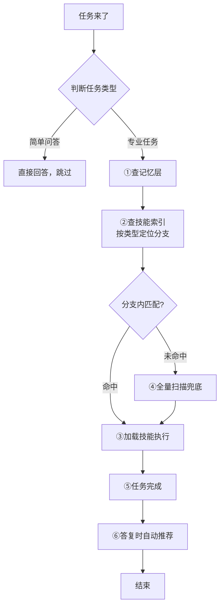

# Skills 宪法（Skills Constitution）

> **一句话定位**：这是凌驾于全部技能/工具/插件之上的**元规则**。无论用什么 Agent 框架，所有能力调用都必须先过这一关。
>
> **v2.8.0** — 新增精选技能注册表 `registry.json`（技能名+来源仓库+描述，按需安装），与「索引=使用者自己生成」思路一致

---

## ⚠️ 前置过滤：任务类型判断（零号条款）

**本宪法仅适用于"专业任务"**，不适用于简单问答。执行前先判断：

| 任务类型 | 特征 | 是否查技能 |
|---------|------|-----------|
| **简单问答** | 翻译、润色、解释概念、一般知识问答 | ❌ 跳过 |
| **专业任务** | 编码、数据抓取、文件操作、API 调用、复杂分析 | ✅ 必须查 |
| **模糊任务** | 不确定是否需要专业工具 | ✅ 查一下（宁可不放过） |

**判断标准**：
- 任务涉及**文件系统、网络请求、代码执行、专业工具** → 专业任务
- 任务只是**文字处理、知识问答、简单解释** → 简单任务

**自我豁免**：本宪法本身是元规则，执行宪法条款时**不需要再次查技能**（防止死循环）。

**误判回退（零号条款-C）**：若 Agent 误判任务类型（如把专业任务当作简单问答跳过），用户有权指出（"这是专业任务，你应该查技能"）。此时 Agent 必须：
1. 道歉并承认误判
2. 立即回退到完整宪法流程（从查记忆开始）
3. 将此次误判记录到记忆层（`MISJUDGMENTS`），避免重复犯错

---

## 痛点

当前 Agent 生态最大的浪费：**装了一堆无敌的 Skill/工具/插件，但 Agent 傻傻的硬扛任务**——明明有更专业的能力可用，却靠通用能力瞎猜，导致：

| 痛点 | 表现 | 后果 |
|------|------|------|
| **不调用** | 任务来了直接干，不扫能力清单 | 装了 100 个技能只用了 3 个 |
| **调用幻觉** | 凭印象选技能，不看描述是否匹配 | 用错技能、答非所问 |
| **调用混乱** | 多个技能都能做，随机挑一个 | 结果不稳定、质量不可控 |
| **能力误判** | 感觉"做不到"就直接拒绝 | 从不检查有没有技能能做 |
| **无复盘** | 做完就走，不看有没有更好技能 | 技能库长期闲置、越装越乱 |
| **扫描全量** | 每次任务扫描全部技能 | 响应慢、消耗高 |

---

## 核心概念（平台无关）

本宪法使用以下**通用术语**，各平台的具体对应物见【平台映射表】：

| 通用术语 | 含义 | 各平台叫法举例 |
|----------|------|----------------|
| **能力注册表** | Agent 当前可用的全部技能/工具/插件清单 | available_skills / tools / plugins / extensions / Gems / MCP servers |
| **技能描述** | 每个能力的触发条件说明 | description / trigger / when_to_use / system prompt |
| **技能索引** | 按功能分类的技能树（预生成，加速匹配）。⚠️ 仓库内 `skill_tree.json` 为**作者快照/示例**，使用者应运行 `scripts/build_skill_tree.py` 生成**自己的**索引 | skill_tree.json（作者快照）/ 你生成的技能树 |
| **技能发现** | 搜索可安装的新能力 | find-skills / GPT Store / SkillHub / MCP Registry / Extensions |
| **记忆层** | 跨会话持久化的规则存储 | MEMORY.md / CLAUDE.md / AGENTS.md / Custom Instructions / .cursorrules |
| **技能文件** | 定义能力的结构化文档 | SKILL.md / GPT Actions / MCP Config / Gem Instructions |

---

## 宪法条款

### 第零条：查记忆（Pre-Check Memory）

**在执行任何任务前，必须先查阅该平台的记忆/规则层**，确认有无相关约定、历史上下文或待办事项。

**各平台记忆层路径**：

| 平台 | 记忆层路径 |
|------|-----------|
| WorkBuddy | `~/.workbuddy/MEMORY.md` + 项目 `.workbuddy/memory/` |
| Claude Code | `CLAUDE.md` 或 `.claude/CLAUDE.md` |
| Cursor | `.cursorrules` + `.cursor/rules/` |
| Windsurf | `.windsurfrules` |
| Cline | `.clinerules` |
| ChatGPT | Custom Instructions |
| Gemini | Gem Instructions |
| Codex | AGENTS.md |
| 通用规则 | 项目根目录 `RULES.md` 或 `.agent/rules.md` |

**查记忆顺序**：
1. 用户级记忆（长期偏好、硬规则）
2. 项目记忆（当前项目约定、历史决策）
3. 今日流水（当天工作记录，避免重复）

**记忆层必备内容**（自举前提：让"查记忆"真正发现技能，v2.3.0 新增）：

为了让宪法自举执行，记忆层中应维护以下两类条目：

| 条目 | 内容 | 示例 |
|------|------|------|
| `INSTALLED_SKILLS` | 已安装技能清单（名称 + 一句话描述） | `file-ops：文件读取/写入工具，用于读取技能索引` |
| `SKILL_INDEX_PATH` | 技能索引文件路径（**你**的技能树，非作者快照） | `<你的平台技能目录>/skill_tree.json`（如 `~/.claude/skills/`） |

示例：

```markdown
INSTALLED_SKILLS:
- file-ops：文件读取/写入工具，用于读取技能索引
- find-skills：技能搜索工具，用于发现新能力
- agent-memory：记忆管理系统

SKILL_INDEX_PATH: <你的技能目录>/skill_tree.json
```

只要按此格式维护记忆层，Agent 查记忆即可"回忆"出技能清单，无需实时扫描，冷启动问题就此解决。

---

### 第一条：先查（Pre-Check）

**每次执行专业任务前，必须先查看能力注册表**，判断有没有能力与当前任务相关。

**优化路径**（v2.2.0 新增；v2.7.0 修正指向）：
1. 先查**你的平台能力注册表**（可用技能/工具/插件清单，如 Claude Code `~/.claude/skills`、Cursor `.cursor/rules`、WorkBuddy available_skills）；有本地技能树则优先用它（运行 `scripts/build_skill_tree.py` 生成**你自己的**索引）
2. 按任务类型定位功能分支
3. 在分支内匹配描述
4. 未命中则全量扫描（兜底）

**执行强化（v2.5.0 新增，无条件第一步）**：

「先查技能索引」必须是**无条件动作**，不是"我觉得需要才查"：
- **任何专业任务（含"查安装/查库"类，如确认某 Python 库是否安装）第一步必须读技能树索引**，禁止以"这不需要查技能"为由跳过——凭判断跳过正是本宪法要防的行为（教训：实际运行中查 cognee 时跳过技能树被用户抓包）
- 技能树索引应包含**技能与已装 Python 库/工具**（🧩 分类），一个入口查全
- 任务开始需**显式汇报「宪法三查」结果**，让流程可见、可被用户监督：
  ```
  【宪法三查】
  ① 记忆 ✅ 已查（用户级/项目/今日流水）
  ② 技能树 ✅ 已读（是否命中相关技能/已装库）
  ③ 匹配 ✅ 命中 X → 用它执行；无命中 → 说明"技能树无匹配"再走通用能力/文件系统
  ```
- 简单问答豁免（翻译/润色/概念解释）

---

### 第二条：匹配必用（Mandatory Use）

只要任务与某个能力的**描述**相关或部分相关 → 无条件优先加载该能力、按其指令执行。

**禁止行为**：
- ❌ 绕开能力直接用通用能力
- ❌ 凭印象选能力不看描述
- ❌ 多个匹配时随机挑一个（应按相关度排序选最优）

**凌驾条款**：即使某个能力说"我可以直接做"，也必须先经本宪法确认没有更好匹配的能力。

---

### 第三条：无匹配 → 技能发现（Search First）

确认能力注册表无匹配后，先通过平台的**技能发现机制**搜索是否有可获取的相关能力。

- 找到 → 提示用户安装/启用后使用
- 没找到 → 进入第四条

---

### 第四条：能力边界（Honest Boundary）

感觉"我做不到 / 没权限 / 没工具"时 → **必须先通过技能发现机制确认**，确认无能力可用才能回复做不到。

**禁止行为**：
- ❌ 不搜索就直接说"做不到"
- ❌ 用通用能力硬扛明明需要专业能力的任务
- ❌ 假装做了但实际没调用能力

---

### 第五条：答复时自动推荐（Auto-Discovery）

任务完成后（答复阶段）→ 自动搜索全网能力库，找出与该任务高度匹配的现成能力推荐给**用户**。

**搜索范围**：
- GitHub（`github.com` 上的 skill/tool/agent 仓库）
- 各平台官方市场（GPT Store / SkillHub / MCP Registry / Extensions Gallery）

**推荐格式**：
```
🔍 顺手搜了一圈，发现这几个能力可能更适合下次用：
- 名称：xxx — 一句话亮点 + 获取方式
（最多 3 个，避免刷屏）
```

**执行细则（v2.6.0 强化）**：
- 推荐内容**必须**是 WebSearch/WebFetch 搜索到的 **GitHub 高 Star 数** skill/tool/agent 仓库（含 star 数 + 链接 + 获取方式），**不是**本地已装技能清单
- **禁止**以"本地已装技能"充当第五条输出（本地技能仅可作补充提示，不能替代 GitHub 搜索）
- 可配合门禁 `constitution-check --step 5` 自动校验推荐板块是否合规（含 `github.com/owner/repo` 链接 + star 数标记 + 获取方式）

---

## 执行闭环（五步流程图）



---

## 技能树（Skill Tree）

按功能类型分类技能，Agent 执行时**按分支定位**，减少扫描范围 80%：

```
技能树/
├── 📜 元规则类（Meta）
│   ├── 宪法/规则定义
│   └── 安全审计
│
├── 🧠 记忆/知识管理类
│   ├── 个人记忆系统
│   ├── 项目知识图谱
│   └── 会话持久化
│
├── 🌐 网络/搜索类
│   ├── 网页自动化
│   ├── 数据抓取
│   ├── API 调用
│   └── 搜索工具
│
├── 💻 开发/编码类
│   ├── 代码生成
│   ├── 代码审查
│   ├── 测试工具
│   └── 构建/部署
│
├── 📄 文档处理类
│   ├── PDF 解析
│   ├── Word/Excel/PowerPoint
│   └── 格式转换
│
├── 🖼️ 内容生成类
│   ├── 图像生成
│   ├── 视频生成
│   └── UI/设计
│
├── 💰 业务专用类
│   ├── 金融/投资分析
│   ├── 法律/合规
│   └── 电商/营销
│
└── 🔧 通用工具类
    ├── 文件操作
    ├── 进程管理
    └── 环境配置
```

**完整索引**：仓库内 `SKILL_TREE.md` / `skill_tree.json` 为**作者快照（示例）**，展示技能树长什么样；**使用者在自己的环境运行 `scripts/build_skill_tree.py` 生成自己的技能树**，或用平台自身的能力清单（见【平台映射表】）

**精选技能清单**：需要"装什么技能"时，查看仓库内 `registry.json`（技能名+来源仓库+描述，精选开源技能，按需安装）

**执行路径优化**：
1. 判断任务属于哪个功能分支
2. 直接查对应分支，避免全量扫描
3. 缩小搜索范围 → 降低 token 消耗 + 提升响应速度

---

## 平台映射表

将本宪法的通用术语映射到各主流 Agent 平台的具体机制：

### 国际平台

| 平台 | 能力注册表 | 技能发现 | 记忆层 / 持久化 | 适配方式 |
|------|-----------|----------|----------------|----------|
| **ChatGPT** (OpenAI) | Custom GPT 的 Actions + Knowledge | GPT Store | Custom Instructions | 将宪法核心条款写入 Custom Instructions；GPT Actions 即"能力" |
| **Claude** (Anthropic) | Claude Code skills + MCP servers | MCP Registry / skill 市场 | CLAUDE.md | 将宪法写入 CLAUDE.md 或 `.claude/skills/`；MCP servers 即"能力" |
| **Codex** (OpenAI) | AGENTS.md 中定义的工具链 | 无内置市场，靠 AGENTS.md 声明 | AGENTS.md | 将宪法写入 AGENTS.md；通过 AGENTS.md 声明可用工具 |
| **Gemini** (Google) | Gems + Extensions | Extensions Gallery | Gem Instructions | 将宪法写入 Gem Instructions；Extensions 即"能力" |
| **Cursor** | .cursor/rules/ + MCP | MCP Registry | .cursorrules | 将宪法写入 `.cursor/rules/skills-constitution.md` |
| **Windsurf** | .windsurfrules + MCP | MCP Registry | .windsurfrules | 将宪法写入 `.windsurfrules` |
| **Cline** | .clinerules + MCP | MCP Registry | .clinerules | 将宪法写入 `.clinerules` |
| **GitHub Copilot** | Agent Mode + MCP | GitHub Marketplace | .github/copilot/instructions.md | 将宪法写入 Copilot 指令文件 |

### 国内平台

| 平台 | 能力注册表 | 技能发现 | 记忆层 / 持久化 | 适配方式 |
|------|-----------|----------|----------------|----------|
| **WorkBuddy / CodeBuddy** | available_skills + MCP connectors | find-skills + SkillHub | MEMORY.md + 用户级 skills | 将宪法写入 `~/.workbuddy/MEMORY.md`；安装为用户级 skill |
| **扣子 (Coze)** | 插件 + 工作流 | 插件商店 | Bot 人设与记忆 | 将宪法写入 Bot 人设提示词；插件即"能力" |
| **文心一言** | 插件 + 知识库 | 插件中心 | 自定义指令 | 将宪法写入自定义指令 |
| **通义千问** | 插件 + 智能体 | 插件市场 | 智能体指令 | 将宪法写入智能体指令 |
| **Kimi** | 工具调用 + 知识库 | 无内置市场 | 系统提示词 | 将宪法写入系统提示词 |
| **豆包** | 插件 + 工作流 | 插件商店 | Bot 人设 | 将宪法写入 Bot 人设提示词 |
| **智谱清言** | 插件 + 知识库 | 插件中心 | 自定义指令 | 将宪法写入自定义指令 |
| **月之暗面** | 插件 + 工具 | 插件市场 | 系统提示词 | 将宪法写入系统提示词 |
| **Dify** | 工具 + 工作流 | 插件市场 | 系统 Prompt | 将宪法写入系统 Prompt |

**支持级别说明**（诚实声明，v2.3.0 新增）：

| 级别 | 含义 | 平台 |
|------|------|------|
| ✅ **完全支持** | 有本地文件系统 + 可访问的能力注册表/技能文件，宪法可真正执行"查索引→加载技能→执行" | WorkBuddy / Claude Code / Cursor / Windsurf / Cline / Codex |
| ⚠️ **建议型** | 无本地文件系统、无技能文件机制，只能将宪法条款注入提示词/人设，作为行为建议执行，无法真正加载技能文件 | ChatGPT / Kimi / 豆包 / 文心一言 / 通义千问 / 智谱清言 / 月之暗面 / Dify / 扣子 |

> 说明：对"建议型"平台，请勿期待 file-ops / find-skills 等本地技能机制生效；宪法在这些平台上以提示词约束的形式工作，效果取决于平台对系统提示词的遵循程度。

### 通用适配（任何 Agent 框架）

对于不在上表的框架，通用适配方式：

1. **找到该框架的"持久化规则"机制**（系统提示词 / 记忆文件 / 配置文件）
2. **将宪法五条核心条款注入该机制**
3. **确保 Agent 在任务执行前能访问能力清单**
4. **确保 Agent 在"无匹配"和"能力边界"两个节点能触发搜索**

---

## 快速注入模板

以下模板可直接复制到各平台的规则/指令/记忆层中：

```markdown
## Skills 宪法（Skills Constitution）v2.8.0

本规则优先级高于全部技能/工具/插件。任何能力调用必须先过这一关。

执行路径：
1. 先查记忆：查阅平台记忆层（MEMORY.md/CLAUDE.md 等）确认相关规则
2. 先查技能：查看技能索引，按任务类型定位功能分支
3. 匹配必用：有匹配则无条件优先使用该能力
4. 无匹配必搜：先搜索可获取的能力，再考虑通用能力
5. 能力边界：说"做不到"前必须先搜索确认无能力可用
6. 答复推荐：任务完成后自动搜索全网能力库，推荐更优能力给用户

违规判定：跳过查记忆/技能清单直接干 / 有匹配但不用 / 未搜索就拒绝 / 无复盘推荐
```

---

## 配套要求

### 对能力作者（任何平台）
- **描述必须写准**：它是能力被匹配的唯一依据。写歪了 = 白装。
- **触发条件明确**：写清楚"什么时候该用我"，不要只写"我能做什么"。
- **遵循平台规范**：不同平台对能力文件格式有不同要求（frontmatter / JSON / YAML），按规范来。
- **分类准确**：确保 `description` 包含可被分类的关键词，方便技能树索引。

### 对 Agent 框架开发者
- 每次会话启动时将本宪法注入上下文，确保每次任务前可见。
- 能力注册表必须在任务执行前可访问。
- 技能发现机制必须在"无匹配"和"能力边界"两个节点可被调用。
- **推荐**：支持预生成技能索引（如 `skill_tree.json`），加速匹配。

---

## 与其他规则的关系

```
优先级从高到低：

1. 🔴 系统安全规则（不可违反）
2. 📜 Skills 宪法（本规则）—— 凌驾于全部技能/工具/插件之上
3. 🔧 具体能力的执行指令
4. 🤖 Agent 通用能力
```

---

## 违规判定

以下行为属于**严重违规**，用户有权要求重做并说明理由：

| 违规行为 | 判定标准 |
|----------|----------|
| 跳过查记忆直接干 | 任务完成但未查阅平台记忆层 |
| 跳过查技能清单直接干 | 任务完成但未加载任何相关能力 |
| 有匹配但不用 | 能力注册表中有匹配能力但未加载 |
| 未搜索就拒绝 | 说"做不到"但未通过技能发现机制确认 |
| 无复盘 | 答复时未搜索全网能力库（当任务与能力库明显相关时） |

---

## 技术边界说明

"无条件启用全部能力"在技术上不可行——大量能力全量加载会撑爆上下文窗口。能力机制的正确设计是**按描述匹配触发**，本宪法的作用就是确保这个匹配机制被**强制执行**，不被跳过。

**v2.3.0 优化**：通过技能树索引按功能分类，将扫描范围从"全量 659 个技能"缩小到"目标分支 ~50 个技能"，减少 80%+ token 消耗。索引由 `scripts/build_skill_tree.py` 脚本生成并自检（分类条数和 ≥ total），**禁止手写索引**，从源头杜绝数据不一致。

---

## 安装

### WorkBuddy / CodeBuddy（用户级，跨项目生效）
```bash
cp -r skills-constitution ~/.workbuddy/skills/skills-constitution/
# 生成技能树索引（可选，建议定期运行）
python scripts/build_skill_tree.py
```

### Claude Code
```bash
# 项目级
cp -r skills-constitution .claude/skills/skills-constitution/
# 用户级
cp -r skills-constitution ~/.claude/skills/skills-constitution/
```

### Cursor
```bash
# 将宪法写入规则目录
cp SKILL.md .cursor/rules/skills-constitution.md
```

### ChatGPT / Gemini / 其他
将【快速注入模板】中的内容复制到：
- ChatGPT → Custom Instructions 或 GPT 的 System Prompt
- Gemini → Gem 的 Instructions
- 其他 → 系统提示词 / 记忆层

---

## 验证安装

### WorkBuddy
```bash
# 检查技能是否加载
ls ~/.workbuddy/skills/skills-constitution/SKILL.md

# 生成技能树索引
python scripts/build_skill_tree.py

# 查看索引
cat skill_tree.json | jq '.total'
```

### 通用
执行任意专业任务，观察是否先查记忆、再查技能、后有匹配必用。

---

## 门禁校验机制（v2.6.0 新增）

> 目的：把「靠 Agent 自觉」变成「可校验、可拦截」。校验脚本只负责 PASS/FAIL；真正的强制触发依赖宿主 hook（如 WorkBuddy/Claude Code 的钩子），无 hook 环境退化为软校验。
>
> ⚠️ **仅适用专业任务**：简单问答（翻译、润色、解释概念、一般知识问答）按**零号条款**跳过，**不跑门禁**——调用方应传 `--simple` 声明（脚本直接 SKIP 退出），防止简单任务被误拉去校验（如无推荐板块导致误 FAIL）。

### 目录结构
```
scripts/
├── constitution-check          # 主入口
├── steps/
│   ├── step1-check.py          # 三查汇报校验
│   ├── step2-check.py          # 技能树已读/无匹配声明
│   ├── step3-check.py          # 匹配技能调用
│   ├── step4-check.py          # 交付自检（非版本类任务自动跳过）
│   └── step5-check.py          # 推荐板块（GitHub 链接 + star 数）
└── lib/
    ├── state.py                # 状态文件（.constitution-state.json，链式依赖）
    └── text.py                 # 文本/正则工具
```

### 用法
```bash
# 全量软校验（默认：FAIL 只警告，不阻断）
python scripts/constitution-check --input output.txt

# 严格模式：FAIL 即阻断（exit 1）
python scripts/constitution-check --input output.txt --strict

# 简单任务豁免（零号条款：翻译/润色/概念解释，跳过门禁）
python scripts/constitution-check --simple

# 只跑指定 step（如推荐板块校验）
python scripts/constitution-check --step 5 --input output.txt

# 机器可读输出 / 重置状态
python scripts/constitution-check --input output.txt --json
python scripts/constitution-check --reset
```

### 设计要点
- **默认软校验、`--strict` 可选**：宪法正文永远是"行为规则"（任何平台可遵守的兜底）；脚本是"增强层"。**禁止**把"必须先跑脚本"写进宪法正文——在跑不了脚本的环境（ChatGPT/Kimi/豆包等建议型平台）会被 Agent 判为"不可满足"而整体跳过宪法
- **链式依赖**：状态文件记录每步 PASS/FAIL，strict 模式下前置 step 未通过则拒绝执行下一步（逐步验证再往下走）
- **校验输入 = Agent 输出文本 + 状态痕迹**：设计上要求 Agent 每步显式输出产物并调用 check 写状态，脚本才有内容可查
- 校验失败在软模式下仅警告，脚本 bug/状态丢失不会卡死任务

---

## 贡献指南

欢迎提交 Issue 和 PR：
- **功能增强**：扩展分类规则、增加平台映射
- **文档优化**：修正表述、增加示例
- **Bug 修复**：分类逻辑、脚本错误

---

## License

MIT License — 随意使用、修改、分发。

---

## 作者

**jiabaobei** — [GitHub](https://github.com/jiabaobei)

*如果这个规则帮你解决了 Agent 不调用能力的问题，欢迎 ⭐ Star 收藏！*
